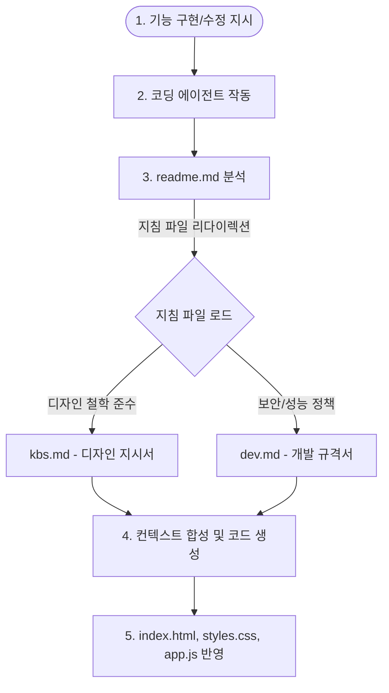

# 에이전트 협업 및 개발 프로세스 안내서 (description.md)

이 문서는 Aura Calc 프로젝트에서 사용자(기획자/디자이너)와 AI 코딩 에이전트(Agent)가 어떻게 협업하고 코드를 안전하게 개선해 나가는지 그 동작 원리와 워크플로우를 정리한 안내서입니다.

---

## 🤖 에이전트 구동 아키텍처 (Agentic Architecture)

AI 코딩 에이전트는 사용자의 요구사항을 받아 독립적으로 소스 코드를 조사하고 수정 작업을 진행합니다. 이때 일관성 있고 안전한 구현을 보장하기 위해 본 레포지토리는 **'레포지토리 레벨 프롬프트 엔지니어링(Repository-Level Prompt Engineering)'** 구조를 도입했습니다.

### 🔄 워크플로우 흐름도

---

## 📂 지침 파일의 역할과 구성

에이전트는 코드 수정 작업을 시작하기 전에 아래 파일들을 참조하여 스스로 가이드라인을 세우고 행동 지침을 규제합니다.

### 1. [readme.md](file:///c:/Users/tomba/OneDrive/문서/GitHub/ex07-agent/readme.md) (프로젝트 맵)
- 에이전트가 레포지토리를 스캔할 때 가장 먼저 읽는 진입점 문서입니다.
- 디자인 변경이나 기능 개발 시 반드시 `kbs.md`와 `dev.md`를 우선적으로 참조하여 개발할 것을 총괄적으로 지시하고 있습니다.

### 2. [kbs.md](file:///c:/Users/tomba/OneDrive/문서/GitHub/ex07-agent/kbs.md) (디자인 지시서)
- **주요 소유자:** 디자이너 (UX/UI 스펙 관리자)
- **역할:** 전체 색상 스킴(오렌지/그레이 테마), 입체 버튼 그라데이션, 고대비 아이콘과 글자색 규칙 등 시각적 규격을 정의합니다.
- **효과:** 에이전트가 새로운 UI 컴포넌트를 구성할 때 본래 정의된 오렌지 테마의 조화를 해치지 않고 일관성 있게 디자인하도록 강제합니다.

### 3. [dev.md](file:///c:/Users/tomba/OneDrive/문서/GitHub/ex07-agent/dev.md) (개발 규격서)
- **주요 소유자:** 프론트엔드 개발자 (시스템 아키텍트)
- **역할:** 안전한 수식 연산(new Function 제한 스코프 및 eval 사용 절대 금지), 부동 소수점 오차 수정 공식, LocalStorage 데이터 키 설계 및 웹 접근성(a11y) 기준을 규정합니다.
- **효과:** 에이전트가 자의적으로 보안에 취약한 코드나 스택 규정에 맞지 않는 외부 라이브러리를 추가하는 행동을 원천 방지합니다.

---

## 💡 효과적인 에이전트 조작 팁

프로젝트를 발전시키면서 에이전트에게 새로운 변경 지시를 내릴 때, 아래 팁들을 활용하면 한층 더 스마트하게 동작을 조율할 수 있습니다.

- **디자인 변경이 필요할 때:**
  - 예: *"모바일 최적화 레이아웃으로 변경해 줘. 변경 사양은 kbs.md에 먼저 업데이트하고 적용해."*
- **기능 확장이 필요할 때:**
  - 예: *"공학용 계산 기능(루트, 제곱 등)을 추가해 줘. 보안 및 상태 저장 방식은 dev.md 규격을 준수해서 만들어."*
- **대화식 설계를 원할 때:**
  - 에이전트에게 의사결정을 위임하고 질답을 주고받고 싶을 경우 UI 단축 기능인 `/grill-me` 명령어를 추천합니다. 에이전트가 정책에 필요한 사항을 역으로 질문해 줍니다.
